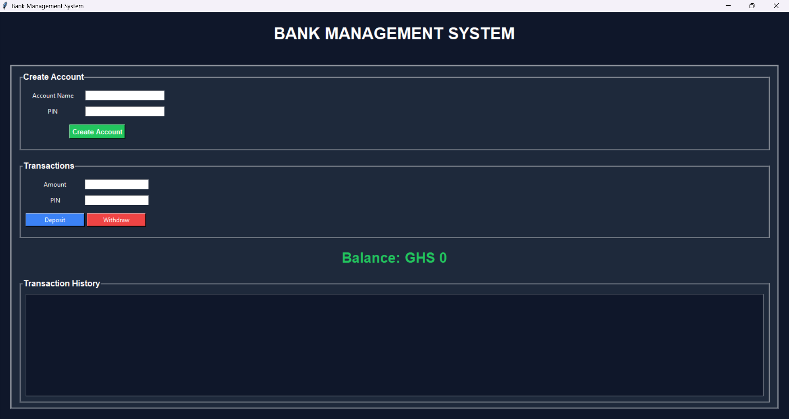

# Bank Management System

A GUI-based Bank Management System built with Python and Tkinter using OOP principles.

## Features
- Create Account
- Deposit Money
- Withdraw Money
- PIN Authentication
- Transaction History
- Live Balance Updates

## Technologies Used
- Python
- Tkinter
- Object-Oriented Programming (OOP)

## Screenshot



## How To Run

```bash
python bank_management_system.py